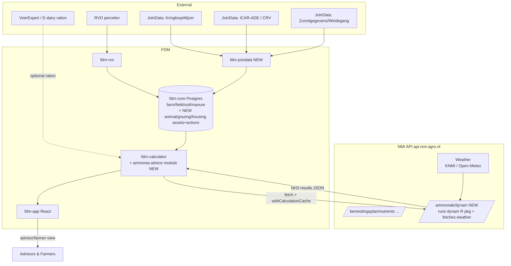

# Report 3 — Extending FDM to Run DynAm via the NMI API (called from fdm-calculator) and Present Results in fdm-app

## Executive Summary

This report specifies how to extend **FDM** (the NMI Farm Data Model — a TypeScript monorepo on Drizzle ORM / PostgreSQL + PostGIS, MIT-licensed) so that it can (1) **hold the missing data** DynAm needs — **animal/herd, grazing and housing** — using FDM's own **asset-action data model**, (2) **run DynAm** by calling it as an endpoint on the **NMI API (`api.nmi-agro.nl`)** from **`fdm-calculator`**, exactly as `fdm-calculator` already calls the NMI API for nutrient advice, and (3) **present the ammonia-emission results** in a new **fdm-app** view for dairy advisors and farmers.[^1] FDM today is field/parcel/soil/fertilizer-centric with rich nitrogen data (including manure ammonium-N and per-product NH₃ emission factors) but has **no animal, herd, milk, feed or grazing-hours data** — only a boolean `intending_grazing` flag.[^2] It already ships a **mature external-data connector pattern** (`fdm-rvo`: OAuth2 → fetch → compare → process) that is the blueprint for a JoinData connector.[^3]

The key design choice — following the existing `fdm-calculator` pattern — is that **DynAm is hosted behind the NMI API, not called as a bespoke service**. `fdm-calculator` already delegates its heaviest scientific computations (nutrient advice `POST /bemestingsplan/nutrients`, N-supply `/nsupply`, dynamic-N `/dyna`, BLN3, soil estimates) to `https://api.nmi-agro.nl` via native `fetch()` with an `Authorization` header, an `NMI-API-Version: v1` header, an `AbortController` timeout, Zod validation, and a `withCalculationCache` wrapper for DB-backed caching.[^4] The modernized `dynam` R package (Report 2) is deployed **behind that same NMI API** as a new ammonia endpoint (e.g. `POST /ammoniak/dynam`) which also fetches weather server-side; `fdm-calculator` gains a new `ammonia-advice/` (DynAm) module that calls it in exactly the same way. New farm data is added to `fdm-core` in the **asset-action style** — **individual `animals` combined into `herds`** (lactation groups) via an `animal_grouping` action, with per-animal events (milk recording, weighing, calving) from ICAR-ADE and a `herd_producing` aggregate fallback for KLW-only farms — and a `fdm-joindata` connector auto-populates it from KLW/ICAR-ADE. The R package stays pure; all HTTP, weather-fetch and caching live in the NMI API and `fdm-calculator` respectively.[^4]

---

## 1. Current FDM Starting Point

**Tech stack:** TypeScript, pnpm workspaces + Turborepo, **Drizzle ORM on PostgreSQL** (schema `fdm`) with **PostGIS**, Vitest, React (React Router v7) frontend, Microsoft Identity auth, GitHub Actions CI, Docker. MIT-licensed, NMI-maintained, funded by Horizon Europe NutriBudget + PPS BAAT.[^1]

**Monorepo packages:** `fdm-core` (schema + CRUD library), `fdm-data` (catalogues), `fdm-calculator` (nutrient/N-balance), `fdm-api` (API server), `fdm-app` (React frontend), `fdm-rvo` (RVO connector), plus `fdm-agents`, `fdm-helpdesk`, `fdm-docs`.[^1]

**What FDM already provides for DynAm:**[^5]
- Farm identity (`b_id_farm`, KVK) and **postcode** (`farms.b_postalcode_farm`) → location for soil & weather lookup.
- **Soil type and properties** (`soil_analysis.b_soiltype_agr`, pH, N) → DynAm soil inputs.
- **Fields / grassland** geometry and area → grazed area.
- **Manure applications** with type, amount, method, date, **ammonium-N (`p_nh4_rt`) and per-product NH₃ emission factor (`p_ef_nh3`)** → a *better* basis for DynAm's manure-application module than the legacy 16% factor.[^6]
- Grazing intention (boolean per farm/year), derogation, organic status.

**What FDM is missing for DynAm:**[^2]
- Animal data: herd size, cattle categories, milk production/composition, body weight, parity, days-in-milk.
- **Quantitative grazing** (hours/days per year — only a boolean intention exists).
- Housing detail: stable/RAV type, floor area, pit area, milking system.
- Feed/ration and per-animal N-excretion.
- Any **weather** data (FDM stores no weather).
- Any JoinData/KLW connector.

---

## 2. Target Architecture



**Separation of concerns:** the `dynam` R package (Report 2) is pure and stateless; it is deployed **behind the NMI API** as the `/ammoniak/dynam` endpoint, which owns HTTP and server-side weather retrieval; **`fdm-calculator`** calls that endpoint and owns caching (`withCalculationCache`), exactly as it does for nutrient advice; `fdm-core` owns persistence (asset-action tables); `fdm-app` owns presentation.[^4]

---

## 3. Step 1 — Extend the FDM Schema in the Asset-Action Model (fdm-core)

FDM's schema follows a strict **asset-action** pattern: **asset** tables hold identity only (a `*_id` primary key plus `created`/`updated`), while **action** tables — named `<asset>_<verb>ing` — carry all time-bounded, relational and event data, referencing the asset PK (and the farm PK for farm-linking actions) with temporal columns (`b_start`/`b_end`, `m_start`/`m_end`, or single-point dates) and optional `_method` enums.[^7] Existing examples: `fields`→`field_acquiring`/`field_discarding`, `cultivations`→`cultivation_starting`/`cultivation_ending`/`cultivation_harvesting`, `fertilizers`→`fertilizer_acquiring`/`fertilizer_applying`, `soil_analysis`←`soil_sampling`, `measures`←`measure_adopting`, and the farm-level `intending_grazing`.[^8] The new DynAm data is added in the **same style** rather than as flat tables.

### 3.1 Two grains: individual `animals` combined into `herds`

Because ICAR-ADE delivers **per-animal** data while KLW delivers **farm/herd aggregates**, and because the asset-action model favours granular assets with aggregation done in analysis, model **both**: individual animals as assets, combined into herds (which double as DynAm's lactation groups) via a grouping action.[^9] DynAm's per-group inputs are then *derived* from the individuals (or taken from an aggregate action when individuals are unavailable — §3.4).

```ts
// ASSET — an individual animal (identity only; from ICAR-ADE / I&R)
export const animals = fdmSchema.table("animals", {
  b_id_animal:  text().primaryKey(),
  b_id_eartag:  text(),                     // I&R life number / ear tag
  b_breed:      text(),
  b_birthdate:  timestamp({ withTimezone: true }),
  b_sex:        animalSexEnum(),
  created: timestamp({ withTimezone: true }).notNull().defaultNow(),
  updated: timestamp({ withTimezone: true }),
})

// ASSET — a herd / lactation group (identity only)
export const herds = fdmSchema.table("herds", {
  b_id_herd:   text().primaryKey(),
  b_name_herd: text(),                       // "Hoogproductief", "Droogstand", ...
  created, updated,
})

// ACTION — herd belongs to a farm (mirrors field_acquiring) + herd_discarding
export const herdAcquiring = fdmSchema.table("herd_acquiring", {
  b_id_herd: text().notNull().references(() => herds.b_id_herd),
  b_id_farm: text().notNull().references(() => farms.b_id_farm),
  b_start:   timestamp({ withTimezone: true }),
  created, updated,
}, (t) => [primaryKey({ columns: [t.b_id_herd, t.b_id_farm] })])

// ACTION — combine an animal into a herd/group for a period ("combine in herds")
export const animalGrouping = fdmSchema.table("animal_grouping", {
  b_id_animal: text().notNull().references(() => animals.b_id_animal),
  b_id_herd:   text().notNull().references(() => herds.b_id_herd),
  m_start:     timestamp({ withTimezone: true }),
  m_end:       timestamp({ withTimezone: true }),   // NULL = currently in this herd
  created, updated,
}, (t) => [primaryKey({ columns: [t.b_id_animal, t.b_id_herd, t.m_start] })])
```

### 3.2 Per-animal event actions (from ICAR-ADE)

These capture the granular records exactly as delivered by CRV/MPR, so nothing is lost on import; DynAm aggregates them per herd at run time.[^9][^12]

```ts
// ACTION — test-day milk recording per animal
export const animalMilkRecording = fdmSchema.table("animal_milk_recording", {
  b_id_recording:  text().primaryKey(),
  b_id_animal:     text().notNull().references(() => animals.b_id_animal),
  b_recording_date: timestamp({ withTimezone: true }),
  b_milk:          numericCasted(),   // kg/day
  b_milk_fat:      numericCasted(), b_milk_protein: numericCasted(), b_milk_lactose: numericCasted(),
  b_milk_urea:     numericCasted(),
  created, updated,
})

// ACTION — body-weight measurement per animal
export const animalWeighing = fdmSchema.table("animal_weighing", {
  b_id_weighing:   text().primaryKey(),
  b_id_animal:     text().notNull().references(() => animals.b_id_animal),
  b_weighing_date: timestamp({ withTimezone: true }),
  b_weight:        numericCasted(),   // kg
  created, updated,
})

// ACTION — calving / lactation start (→ parity and days-in-milk are derivable)
export const animalCalving = fdmSchema.table("animal_calving", {
  b_id_calving:  text().primaryKey(),
  b_id_animal:   text().notNull().references(() => animals.b_id_animal),
  b_calving_date: timestamp({ withTimezone: true }),
  b_parity:      integer(),
  created, updated,
})
```

### 3.3 Grazing at herd grain

```ts
// ACTION — a herd grazes a field for a period (mirrors measure_adopting: + m_start/m_end)
export const herdGrazing = fdmSchema.table("herd_grazing", {
  b_id:        text().references(() => fields.b_id),      // optional: grazed field
  b_id_herd:   text().notNull().references(() => herds.b_id_herd),
  m_start:     timestamp({ withTimezone: true }),
  m_end:       timestamp({ withTimezone: true }),         // NULL = ongoing
  b_graze_days:  integer(),          // days/year
  b_graze_hours: numericCasted(),    // hours/day
  b_graze_area:  numericCasted(),    // ha actually grazed
  b_graze_type:  grazeTypeEnum(),    // "full" | "partial"
  created, updated,
}, (t) => [primaryKey({ columns: [t.b_id_herd, t.m_start] })])
```

### 3.4 Herd-aggregate fallback and DynAm derivation

For farms without MPR/ICAR-ADE enrollment, only **KLW farm/annual aggregates** are available. Capture these as a herd-level aggregate action, used when individual records are absent:[^11]

```ts
// ACTION — aggregate herd composition for a period (KLW fallback when no individuals)
export const herdProducing = fdmSchema.table("herd_producing", {
  b_id_producing: text().primaryKey(),
  b_id_herd:      text().notNull().references(() => herds.b_id_herd),
  m_start:        timestamp({ withTimezone: true }),
  m_end:          timestamp({ withTimezone: true }),
  b_n_cows:       integer(),
  b_weight:       numericCasted(),   // mean kg
  b_milk:         numericCasted(),   // mean kg/cow/day
  b_milk_fat:     numericCasted(), b_milk_protein: numericCasted(), b_milk_lactose: numericCasted(),
  b_dim:          integer(),         // mean days in milk
  b_parity:       numericCasted(),   // mean parity
  created, updated,
})
```

**Derivation for DynAm:** a helper (in `fdm-core` or the `fdm-calculator` request builder) produces DynAm's up-to-5 lactation-group inputs per herd by, in priority order: (1) **aggregating the individual animals** currently in the herd (`animal_grouping` with `m_end IS NULL`) — `b_n_cows` = count, mean `b_weight` from the latest `animal_weighing`, mean milk & composition from the latest `animal_milk_recording`, `b_dim`/`b_parity` from `animal_calving`; or (2) falling back to `herd_producing` when individuals are unavailable. This keeps storage granular while giving DynAm the group-level values it needs, and records provenance per field.[^9]

### 3.5 Housing as an asset + action

Housing (the barn) is a distinct physical entity, so it is its own *asset* with a farm-linking *action* — mirroring how catalogues/measures are modelled — rather than a column on the farm.[^9]

```ts
// ASSET — the housing/barn (identity)
export const housings = fdmSchema.table("housings", {
  b_id_housing: text().primaryKey(),
  created, updated,
})

// ACTION — farm uses a housing over a period; carries the DynAm-relevant characteristics
export const housingUsing = fdmSchema.table("housing_using", {
  b_id_housing:     text().notNull().references(() => housings.b_id_housing),
  b_id_farm:        text().notNull().references(() => farms.b_id_farm),
  m_start:          timestamp({ withTimezone: true }),
  m_end:            timestamp({ withTimezone: true }),   // NULL = current
  b_rav_type:       text(),           // e.g. "A1.100"
  b_floor_area:     numericCasted(),  // m2
  b_pit_area:       numericCasted(),  // m2
  b_milking_system: text(),
  created, updated,
}, (t) => [primaryKey({ columns: [t.b_id_housing, t.b_id_farm] })])
```

### 3.6 DynAm results — cached, not a bespoke table

Following the `fdm-calculator` convention, DynAm **results are not stored in a bespoke `dynam_results` table**. They are obtained by calling the NMI API and are cached with the same **`withCalculationCache`** mechanism used for nutrient advice, N-supply and DYNA (DB-backed, keyed on the input hash, model/calculator version, with the API key excluded from the cache key).[^10] If an auditable multi-year *history* is required for the advisory UI, it is added in asset-action style as a farm- or herd-linked action (e.g. `herd_emitting` referencing `b_id_herd`, `m_start`/`m_end`, the four NH₃ pathway values, and the model version), populated from the cached result — keeping results consistent with the rest of the model.[^9]

### 3.7 CRUD and reuse of existing data

Add `animal.ts` / `herd.ts` / `housing.ts` CRUD modules exporting `addAnimal`/`getAnimals`/`addAnimalMilkRecording`/`addAnimalWeighing`/`addHerd`/`addAnimalGrouping`/`addHerdGrazing`/`addHerdProducing`/`addHousingUsing` from `fdm-core/src/index.ts`, mirroring the existing `addField`/`addCultivation`/`setGrazingIntention` functions and the `<asset>_<verb>ing` action pattern.[^8] Do **not** duplicate what FDM already holds: soil from `soil_analysis`, grassland/grazed area from `fields`+`cultivations`, location from `farms.b_postalcode_farm`, and manure-application NH₃ inputs from `fertilizer_applying` + `fertilizers_catalogue` (`p_nh4_rt`, `p_ef_nh3`, `p_app_method`) — the last of which lets DynAm's manure module use real farm data instead of the legacy flat 16% factor.[^6]

---

## 4. Step 2 — `fdm-joindata` Connector (KLW / ICAR-ADE / Zuivelgegevens)

Create a new package `fdm-joindata` mirroring `fdm-rvo`'s structure (`auth.ts`, `data.ts`, `compare.ts`, `process.ts`, `types.ts`).[^3]

- **Auth:** OAuth 2.0 against JoinData; per-farmer mandate (*machtiging*) and licensor approval (ZuivelNL for KLW; dairy companies for Zuivelgegevens).[^9]
- **KLW `kringloopWijzer-data` importer:** pulls the **Dier / Voer / Bedrijf / Bodem / Mest** categories → maps **grazing hours/days** (Dier) into `herd_grazing`, herd size/milk aggregates into `herd_producing`, feed quantities/N-excretion into feed tables, stable info (if present) into `housing_using`.[^11]
- **ICAR-ADE importer:** per-animal registration/lactations/milk-recordings/body-weight → individual `animals` + `animal_grouping` (into lactation-group `herds`) + `animal_milk_recording` / `animal_weighing` / `animal_calving`, preserving full granularity.[^12]
- **Zuivelgegevens/Weidegang importer (optional):** grazing status flag and tank milk composition as fallbacks.[^13]
- **Reconciliation:** reuse the `fdm-rvo` compare/process approach (ID match → review → user-approved apply), with Zod schemas in `types.ts`, so imported data is reviewable before it overwrites farm records.[^3]

**Honest scope limit:** JoinData/KLW/ICAR-ADE supply location, grazing, herd and milk, but **not** the per-lactation-group ration nutrient profile (CP/VEM/NDF/ADF/starch/minerals). That remains a VoerExpert / E-dairy input (passed through `fdm-calculator` at run time, or entered in fdm-app).[^14]

---

## 5. Step 3 — Host DynAm on the NMI API (weather-enabled)

Rather than a standalone service, DynAm is deployed **as a new endpoint on the existing NMI API (`https://api.nmi-agro.nl`)** — the same API that already serves `fdm-calculator`'s nutrient advice (`/bemestingsplan/nutrients`), N-supply (`/nsupply`), dynamic-N (`/dyna`), soil estimates (`/estimates`) and BLN3 (`/maatwerk/bln3/...`).[^4] This keeps the modernized `dynam` R package (Report 2) pure: the NMI API wraps it (e.g. via plumber/`callr` inside the NMI API infrastructure) and owns HTTP, auth, versioning and **server-side weather retrieval** — exactly as the NMI API already resolves soil parameters by lat/lon for `/estimates`.[^15]

### 5.1 New endpoint

```
POST https://api.nmi-agro.nl/ammoniak/dynam
Headers: Authorization: <NMI API key>, NMI-API-Version: v1, Content-Type: application/json
Body: {
  "location": { "a_lat": .., "a_lon": .., "postcode": "3731" },
  "soil":     { "b_soiltype_agr": .., "a_ph_cc": .., "a_n_rt": .. },
  "housing":  { "b_rav_type": "A1.100", "b_floor_area": .., "b_pit_area": .., "b_milking_system": ".." },
  "animals":  [ { "b_n_cows": .., "b_weight": .., "b_milk": .., "b_milk_protein": .., "b_dim": .., "b_parity": .. } ],
  "grazing":  { "b_graze_days": .., "b_graze_hours": .., "b_graze_area": .., "b_graze_type": "full" },
  "manure":   [ { "p_nh4_rt": .., "p_ef_nh3": .., "p_app_method": ".." } ],
  "ration":   [ { "cp": .., "vem": .., "ndf": .., "starch": .., "Na": .., "K": .. } ],   // optional (VoerExpert)
  "year": 2016
}
Response: {
  "request_id": "..", "success": true,
  "data": {
    "version": "dynam 1.0.0",
    "emissions": { "weide": .., "stalvloer": .., "stalput": .., "mesttoediening": .., "bedrijftotaal": .. },
    "nutrient_flow": [ { "group": 1, "intake_n": .., "faeces_n": .., "milk_n": .., "urine_n": .. } ]
  }
}
```
Server-side, the endpoint resolves the farm's `a_lat/a_lon` → fetches hourly **temperature, precipitation, evapotranspiration** for the requested year (KNMI, the model's calibration source, or the KNMI Data Platform / Open-Meteo), builds a `dynam_input` and calls `dynam::run_dynam()` (Report 2). The R package consumes weather; it does not fetch it.[^15][^16]

### 5.2 Weather fidelity

The legacy model was calibrated on **KNMI 2007–2016** hourly data; keep KNMI (or an equivalent) as the server-side source and verify emissions stay within the calibrated envelope if a different provider is used.[^16] Weather is naturally cache-friendly per (location, year) and can be cached inside the NMI API.

---

## 6. Step 4 — Call DynAm from `fdm-calculator` (like nutrient advice)

Add a new module `fdm-calculator/src/ammonia-advice/` (or `dynam/`) that calls the NMI API **using exactly the same pattern** as `nutrient-advice/`, `mineralization/nsupply.ts` and `mineralization/dyna.ts`: native `fetch()`, `Authorization` + `NMI-API-Version: v1` headers, an `AbortController` timeout, Zod validation of the response, and a **`withCalculationCache`** wrapper from `@nmi-agro/fdm-core` for DB-backed caching (with `nmiApiKey` excluded from the cache key).[^4]

```ts
// fdm-calculator/src/ammonia-advice/index.ts  (mirrors nutrient-advice/index.ts)
export async function requestAmmoniaEmission(
  input: AmmoniaInputs,          // assembled from fdm-core: location, soil, animals,
): Promise<AmmoniaEmission> {    //   grazing, housing, manure (+ optional ration)
  const controller = new AbortController()
  const timeout = setTimeout(() => controller.abort(), 60_000)   // DynAm is slow, like /dyna
  const res = await fetch("https://api.nmi-agro.nl/ammoniak/dynam", {
    method: "POST",
    headers: {
      "Content-Type": "application/json",
      Authorization: `Bearer ${input.nmiApiKey}`,
      "NMI-API-Version": "v1",
    },
    body: JSON.stringify(buildDynamRequest(input)),   // maps fdm asset-action rows → API JSON
    signal: controller.signal,
  })
  clearTimeout(timeout)
  const parsed = ammoniaResponseSchema.parse(await res.json())   // Zod validation
  return parsed.data
}

// DB-cached, versioned, api-key excluded from the cache key — identical to getNutrientAdvice/getDyna
export const getAmmoniaEmission = withCalculationCache(
  requestAmmoniaEmission, "requestAmmoniaEmission", pkg.calculatorVersion, ["nmiApiKey"],
)
```
`buildDynamRequest(input)` assembles the payload from `fdm-core` asset-action rows (`farms.b_postalcode_farm` + centroid, `soil_analysis`, `animals`/`animal_producing`, `animal_grazing`, `housing_using`, and manure from `fertilizer_applying`/catalogue), attaching the optional VoerExpert ration block if the advisor supplied one — the same "assemble FDM data → build request body" step used by `buildNSupplyRequest`/`buildDynaRequest`.[^4] Because caching, retries and error handling are inherited from the shared calculator pattern (`NmiApiError`), no bespoke persistence or orchestration layer is needed.[^17]

---

## 7. Step 5 — Presentation in `fdm-app`

Add a **"Ammoniak (DynAm)"** section to the React app for a selected farm/year:[^19]
- **Headline:** farm total NH₃ (kg/cow-place/year) with a benchmark comparison to the default/reference farm.
- **Source breakdown:** a stacked bar / donut of `weide`, `stalvloer`, `stalput`, `mesttoediening` (the four DynAm pathways).
- **Per-lactation-group table:** NH₃ and nitrogen flow (intake/faeces/milk/urine N) per group.
- **What-if / advisory panel:** let advisors adjust the ration (crude protein, etc.) or grazing hours and re-run via `fdm-calculator` → NMI API `/ammoniak/dynam`, showing the emission delta — the core "reduce ≥10%" advisory use case.[^18]
- **Data-provenance indicator:** show which fields came from KLW / ICAR-ADE / VoerExpert / defaults (using the `provenance` recorded by `build_dynam_input`), so users trust the numbers.[^19]
- **History:** trend of farm NH₃ over years from the cached calculator results (or the optional `animal_emitting` action, §3.5).

Follow existing fdm-app conventions (React Router v7 routes, MSAL auth, role-based access so farmers see their own farm and advisors see their portfolio).[^1]

---

## 8. Data-Sourcing Summary (who fills what at run time)

| DynAm input | Primary source | FDM location (asset-action) |
|---|---|---|
| Location / postcode | FDM | `farms.b_postalcode_farm` (+ field centroid)[^5] |
| Soil type & properties | FDM | `soil_analysis` via `soil_sampling`[^5] |
| Grazed area / grassland | FDM | `fields` + grass `cultivations`[^5] |
| Manure application NH₃ | FDM | `fertilizer_applying` + catalogue (`p_nh4_rt`,`p_ef_nh3`)[^6] |
| Grazing hours/days | JoinData KLW → FDM | `herd_grazing` (new action)[^11] |
| Herd (cows, weight, parity, DIM) | JoinData ICAR-ADE (individuals) → FDM | `animals` + `animal_grouping` + `animal_*` events; else `herd_producing` (KLW)[^12] |
| Milk (yield, fat/protein/lactose) | JoinData (ICAR/Zuivel/KLW) → FDM | `animal_milk_recording` (individual) / `herd_producing` (aggregate)[^12][^13] |
| Stable/housing type, floor/pit area | KLW (partial) / manual → FDM | `housings` + `housing_using` (new)[^11] |
| **Ration nutrient profile** | **VoerExpert / E-dairy** (run-time) | passed via `fdm-calculator` (not persisted)[^14] |
| Weather | **NMI API `/ammoniak/dynam`** (KNMI/Open-Meteo) | fetched server-side, cached[^16] |
| NH₃ results | **NMI API** (runs `dynam` pkg) | cached via `withCalculationCache`[^10] |

---

## 9. Phased Delivery Plan

| Phase | Scope | Deliverable |
|---|---|---|
| **A. NMI API endpoint** | Deploy the `dynam` R package behind NMI API `POST /ammoniak/dynam` (wrap + server-side weather) | Endpoint returns NH₃ for a hand-built payload[^15] |
| **B. Schema (asset-action)** | Add individual `animals` + `herds` + `animal_grouping`, per-animal events (`animal_milk_recording`/`animal_weighing`/`animal_calving`), `herd_grazing`, `herd_producing` fallback, `housings`+`housing_using` (+ CRUD + DynAm derivation) to `fdm-core` | FDM stores individuals-in-herds + housing in asset-action style[^7][^9] |
| **C. Calculator module** | `fdm-calculator/src/ammonia-advice/`: `requestAmmoniaEmission` + `getAmmoniaEmission = withCalculationCache(...)`, mirroring `nutrient-advice` | `fdm-calculator` computes NH₃ from stored FDM data[^4] |
| **D. Connector** | `fdm-joindata`: KLW + ICAR-ADE importers (auth, fetch, review, apply) → asset-action tables | Auto-populate herd/grazing/milk from JoinData[^3] |
| **E. App** | fdm-app "Ammoniak (DynAm)" view: breakdown, per-group, what-if, provenance, history | Advisors & farmers see and explore results[^20] |

---

## 10. Risks and Notes

- **Consent & licensing:** every JoinData stream needs OAuth2 + farmer mandate + licensor approval; provision for this in onboarding.[^21]
- **KLW is annual & farm-level:** great for grazing hours, N-excretion, herd/milk and validation, but cannot supply the dynamic per-group ration DynAm simulates — keep VoerExpert in the loop for that.[^14]
- **Weather fidelity:** the legacy model was calibrated on KNMI 2007–2016; if the NMI API endpoint uses another weather provider, re-check that emissions stay within the calibrated envelope.[^16]
- **Keep the package pure:** all HTTP, weather-fetch and caching live in the NMI API (`/ammoniak/dynam`) and in `fdm-calculator` (`withCalculationCache`), never in the `dynam` R package, so the package stays testable and reusable.[^4]
- **Consistency with existing calculators:** because DynAm reuses the `fdm-calculator` NMI-API pattern (fetch + `NMI-API-Version` + Zod + `withCalculationCache` + `NmiApiError`), it inherits caching, versioning, retries and error handling for free, and advisory numbers are reproducible via the input-hash cache key.[^4][^17]

---

## Confidence Assessment

| Area | Confidence |
|---|---|
| FDM tech stack, asset-action model, existing schema, connector pattern | **High** — read from `nmi-agro/fdm` (`fdm-core/src/db/schema.ts`, `fdm-rvo/src/*`) + asset-action docs.[^1][^2][^3][^7] |
| `fdm-calculator` calls the NMI API for advice (fetch + `NMI-API-Version` + `withCalculationCache`) | **High** — quoted from `fdm-calculator/src/nutrient-advice`, `mineralization/dyna.ts`, `estimates`, `bln3`.[^4] |
| FDM already covers location/soil/grassland/manure-N for DynAm | **High** — schema fields cited.[^5][^6] |
| JoinData KLW/ICAR-ADE can supply grazing/herd/milk | **High for availability, Medium for exact field mapping** — from JoinData product pages; per-field KLW dictionary needs a live data request.[^11][^12] |
| NMI API `/ammoniak/dynam` endpoint + server-side weather | **Design proposal** — mirrors existing NMI-API endpoints; endpoint does not yet exist.[^4][^15] |
| Weather choice / calibration fidelity | **Medium** — KNMI original; alternatives feasible but need validation.[^16] |
| App design | **High-level design High; UI specifics to be refined with users.** |

---

## Footnotes

[^1]: `nmi-agro/fdm` — README, `fdm-core/drizzle.config.ts`, `package.json`, `docker-compose.yml`; TypeScript/pnpm/Turborepo, Drizzle+PostgreSQL+PostGIS, React (React Router v7), MSAL, MIT license, NMI; packages `fdm-core/-data/-calculator/-api/-app/-rvo/-agents/-helpdesk/-docs`.
[^2]: `nmi-agro/fdm:fdm-core/src/db/schema.ts` — `intending_grazing` (boolean per farm/year) is the only animal-adjacent concept; no animal/herd/milk/feed/ration tables; org code search for animal/herd/milk → 0 results.
[^3]: `nmi-agro/fdm:fdm-rvo/src/` (`auth.ts` OAuth2/PKIoverheid, `data.ts` fetch, `compare.ts` ID/spatial match, `process.ts` apply, `types.ts` Zod) — the connector blueprint.
[^4]: `nmi-agro/fdm:fdm-calculator/src/` — nutrient advice `POST https://api.nmi-agro.nl/bemestingsplan/nutrients` (`nutrient-advice/index.ts` `requestNutrientAdvice` + `getNutrientAdvice = withCalculationCache(...)`), N-supply (`mineralization/nsupply.ts`), DYNA (`mineralization/dyna.ts`, 60s `AbortController`, Zod), soil estimates (`estimates/index.ts`), BLN3 (`bln3/index.ts`); common pattern: native `fetch()`, `Authorization` + `NMI-API-Version: v1` headers, Zod validation, `withCalculationCache` from `@nmi-agro/fdm-core` with `nmiApiKey` excluded from cache key.
[^5]: `nmi-agro/fdm:fdm-core/src/db/schema.ts` — `farms.b_postalcode_farm`, `soil_analysis` (`b_soiltype_agr`, `a_ph_cc`, `a_n_rt`) via `soil_sampling`, `fields`, `cultivations`.
[^6]: `nmi-agro/fdm:fdm-core/src/db/schema.ts` — `fertilizers_catalogue` (`p_n_rt`, `p_nh4_rt`, `p_ef_nh3`) + `fertilizer_applying` (`p_app_method`, amount, date); vs legacy `mef=0.16` (`parms_188.R:9`).
[^7]: Asset-action model — official docs https://nmi-agro.github.io/fdm/docs/getting-started/the-asset-action-model/ (assets = identity; actions = events on assets) + `nmi-agro/fdm:fdm-core/src/db/schema.ts` (`fdmSchema = pgSchema("fdm")`; prefixes `b_`/`p_`/`a_`/`m_`; `created`/`updated`; `b_start`/`b_end`, `m_start`/`m_end`).
[^8]: `nmi-agro/fdm:fdm-core/src/db/schema.ts` — action tables `field_acquiring`/`field_discarding`, `cultivation_starting`/`cultivation_ending`/`cultivation_harvesting`, `fertilizer_acquiring`/`fertilizer_applying`, `soil_sampling`, `measure_adopting`, `intending_grazing`; and `fdm-core/src/index.ts` CRUD pattern (`addField`, `addCultivation`, `setGrazingIntention`).
[^9]: Two-grain asset-action design: individual `animals` (asset) combined into `herds` (asset) via `animal_grouping` (action), per-animal event actions (`animal_milk_recording`/`animal_weighing`/`animal_calving`), `herd_grazing`, and a `herd_producing` aggregate fallback — following the asset-action docs' principle of storing granular components and aggregating in analysis (https://nmi-agro.github.io/fdm/docs/getting-started/the-asset-action-model/); DynAm's per-group inputs are derived from individuals or the aggregate.
[^10]: `withCalculationCache` (from `@nmi-agro/fdm-core`) — DB-backed cache keyed on input hash + calculator version, api key excluded; used by `getNutrientAdvice`/`getNSupply`/`getDyna`/`getBln3Score` in `fdm-calculator`.
[^11]: JoinData KLW `kringloopWijzer-data` endpoint, categories Bedrijf/Dier/Voer/Bodem/Mest incl. grazing hours/days — https://join-data.nl/kringloopwijzer/ ; WUR Rekenregels KLW 2023 https://doi.org/10.18174/643089.
[^12]: JoinData ICAR-ADE DataHub (herd-list/animals/lactations/milk-recordings/body-weight, source CRV/MPR) — https://production.join-data.net/api/docs ; https://github.com/adewg/ICAR.
[^13]: JoinData Zuivelgegevens (eDAIRY): weidegang status (FrieslandCampina) + tank milk fat/protein/lactose — https://join-data.nl/zuivelgegevens/.
[^14]: KLW/ICAR-ADE/eDAIRY contain no per-lactation-group ration nutrient profile; ration from VoerExpert/Schothorst E-dairy.
[^15]: Server-side data fetch precedent — NMI API resolves soil parameters + BRP history by lat/lon for `fdm-calculator/src/estimates` (`GET https://api.nmi-agro.nl/estimates?a_lat=..&a_lon=..`); the proposed `/ammoniak/dynam` endpoint fetches weather the same way and runs the `dynam` R package (Report 2).
[^16]: Weather: model calibrated on KNMI 2007–2016 hourly Temp/Prec/ETH (`main_188.R:39-42`, `02 input/a. weather/`); alternatives KNMI Data Platform / Open-Meteo (https://open-meteo.com/).
[^17]: `fdm-calculator` shared NMI-API concerns — `NmiApiError` class, `AbortController` timeouts (30s/60s), Zod response schemas, `withCalculationCache`; inherited by a new `ammonia-advice` module without bespoke orchestration.
[^18]: Advisory what-if reflects DynAm's design goal of ≥10% reduction via feeding/management — `00 desc/DynAm_beschrijving2.Rmd:30`.
[^19]: Provenance recorded by `build_dynam_input()` (Report 2 §6.2) so the UI can show data origin per field.
[^20]: `nmi-agro/fdm:fdm-app` (React Router v7, MSAL, role-based) — new "Ammoniak (DynAm)" route/view.
[^21]: JoinData access: OAuth2 + farmer mandate (*machtiging*) + licensor approval (ZuivelNL for KLW; dairy companies for Zuivelgegevens) — https://join-data.nl/kringloopwijzer/ , https://join-data.nl/zuivelgegevens/.
