# Dairy Farming in FDM — Implementation Plan

> **In scope:** `fdm-core` schema + CRUD; `fdm-calculator` factor tables + nitrogen-balance extension; `fdm-app` data-entry screens and insight screens. **Out of scope (later):** DynAm model calls, JoinData connector, Voerverkenner/VoerExpert ration import, nmi-api endpoints, automated per-animal I&R/MPR sync.

---

## 1. Executive summary

FDM today is field/parcel/soil/fertilizer-centric. It has **no farm-type field and no animal, herd, milk, feed or grazing data**; the only animal-adjacent concept is a per-year `intending_grazing` boolean.[^1][^2] This plan adds a dairy domain using FDM's own **asset-action model**:

- **Herds** are category-bearing assets; **individual animals** are assets assigned to herds via dated actions, so a farmer's simple "how many cows?" count creates real, later-enrichable animal rows and all counts stay *derived*.
- **Milk** is modelled as tank + delivery inventory, reusing the proven harvest/sampling/analysis chain.
- **Manure** flows from herd → pit → the **existing `fertilizer_acquiring` → `fertilizer_applying` chain**, so own manure automatically enters the nitrogen/organic-matter balance with no new balance plumbing.
- **Feed** batches carry type and origin, unlocking feed self-sufficiency insights.
- **Barns** are assets with a herd↔barn housing action; **grazing** is a herd↔field action.

Insights are delivered by **extending the existing nitrogen balance** (which already exposes an unused grazing-ammonia hook) plus a few self-contained dairy KPI apps computed from official, year-keyed Dutch standard factors (GVE, RVO excretion forfaits, gebruiksnormen) stored the way `fdm-calculator` already stores legal norms. In the app, **data entry lives in the sidebar "Bedrijf" group** and **insights live in the dashboard "Apps" cards** — the established, intuitive split.

This document gives the definitive schema (§4), the factor store (§5), the insight catalogue (§6), the app information architecture and wireframes (§7), the implementation plan (§8), open questions (§9) and a confidence assessment (§10).

---

## 2. Design principles & conventions to honour

- **Asset-Action model.** Assets = lasting identity (farms, fields, animals, herds, barns…). Actions = dated events on assets (arriving, assigning, milking, feeding…). **Store raw data + discrete action; aggregate later — never store pre-computed metrics.** New attributes belong in new action tables, not new columns on core assets.[^3]
- **Column prefixes:** `b_` general/farm/field/animal/milk/grazing assets, `p_` fertilizer/manure, `a_` soil analysis, `f_` feed, `m_` measures/temporal, `d_` derived.[^4]
- **CRUD pattern:** `fn(fdm, principal_id, …)` → `checkPermission` first → mutate inside `fdm.transaction` → IDs via `createId()` → `grantRole` on new assets → wrap failures with `handleError`.[^5]
- **Authorization:** resource list + roles `owner/advisor/researcher` + actions `read/write/list/share`; `getResourceChain` walks child→farm so any farm-scoped resource inherits farm permissions.[^6]
- **Product/design:** raw data in / connected insight out (never ask for derived values); lower the data-entry barrier; make insight discoverable; earn trust through transparent, auditable numbers. The insight layer is the reward that motivates data entry.[^7]

Two reusable patterns this plan leans on, both verified in the codebase:
- **Harvest chain** — `harvestables` (asset) → `cultivation_harvesting` (action) → `harvestable_sampling` (action) → `harvestable_analyses` (data), with totals computed only at read time (no stored aggregates → no double counting).[^8]
- **Norms factory** — legal, yearly-changing factors live in `fdm-calculator/src/norms/nl/{year}/value/*-data.ts` as hard-coded TS tables, dispatched by `createFunctionsForNorms(region, year)`, wrapped in `withCalculationCache`; spatial keys come from GeoTIFFs.[^9]

---

## 3. Farm-type gating

Add `b_type_farm` to the `farms` asset as a **multi-select enum array** (`farmTypeEnum`: `arable`, `dairy` — no `mixed`; a mixed farm selects both).[^10] All dairy UI is gated on `b_type_farm` containing `"dairy"`, optionally combined with a PostHog `dairy` feature flag for staged rollout. Existing farms backfill to `{arable}` (or empty → treated as non-dairy). It is set/edited on the farm settings "properties" page via the existing `MultiSelect` component.[^11]

> Farm sector is durable identity, so it is a justified column on the `farms` asset (like `b_postalcode_farm`), not an action.

---

## 4. Schema (`fdm` Postgres schema)

Green = asset, yellow = action. Items marked **L3** are defined now but built with the later DynAm/JoinData work.

```mermaid
erDiagram
    farms {
        text b_id_farm PK
        farmType_arr b_type_farm "arable|dairy (multi)"
    }
    barns ||--o{ barn_acquiring : "to farm"
    farms ||--o{ barn_acquiring : ""
    barns ||--o{ barn_discarding : ""
    herds ||--o{ herd_acquiring : "to farm"
    farms ||--o{ herd_acquiring : ""
    herds ||--o{ housing : "housed in barn"
    barns ||--o{ housing : ""
    herds ||--o{ grazing : "grazes field"
    fields ||--o{ grazing : ""
    animals ||--o{ animal_arriving : "born/purchased"
    farms ||--o{ animal_arriving : ""
    animals ||--o{ animal_leaving : "died/sold"
    animals ||--o{ animal_assigning : "assigned to herd (m_start/m_end)"
    herds ||--o{ animal_assigning : ""
    herds ||--o{ milking : "milk into tank"
    milk_tanks ||--o{ milking : ""
    animals ||--o{ milking_animal : "milk into tank (per animal)"
    milk_tanks ||--o{ milking_animal : ""
    milk_tanks ||--o{ delivering : "milk out"
    milk_deliveries ||--o{ delivering : ""
    milk_deliveries ||--o{ milk_sampling : ""
    milk_analyses ||--o{ milk_sampling : ""
    herds ||--o{ excreting : "manure into pit"
    manure_pits ||--o{ excreting : ""
    manure_pits ||--o{ fertilizer_acquiring : "own manure -> Fertilizer (EXISTING chain)"
    fertilizers ||--o{ fertilizer_acquiring : ""
    manure_pits ||--o{ manure_discarding : "exported"
    manure_deliveries ||--o{ manure_discarding : ""
    manure_deliveries ||--o{ manure_sampling : ""
    manure_analyses ||--o{ manure_sampling : ""
    feed_batches ||--o{ feeding : "fed to herd"
    herds ||--o{ feeding : ""
    feed_batches ||--o{ feeding_animal : "fed to animal (supplemental)"
    animals ||--o{ feeding_animal : ""
    feed_batches ||--o{ feed_sampling : ""
    feed_analyses ||--o{ feed_sampling : ""
    animals ||--o{ animal_milk_recording : "L3 robot/MPR"
```



### 4.1 Herds & animals

```
herds (ASSET):
  b_id_herd       text PK
  b_name_herd     text                 -- "Melkkoeien", "Jongvee <1jr", "Droogstand"
  b_herd_category animalCategoryEnum    -- RVO diercategorie; drives GVE & excretion
  created / updated

herd_acquiring (ACTION, herd->farm) + herd_discarding (b_id_herd PK, b_end):
  b_id_herd text NN FK, b_id_farm text NN FK, b_start, created/updated; PK (b_id_herd, b_id_farm)

animals (ASSET):
  b_id_animal      text PK
  b_id_eartag      text             -- I&R life number (NULL for count-created placeholders)
  b_id_worknumber  text             -- I&R werknummer; shorter on-farm working number, distinct from the lifetime eartag
  b_species        animalSpeciesEnum -- RVO diersoort; cattle-only today (rund), kept as an enum so sheep/goat/equine aren't a schema change later
  b_breed          text
  b_coatcolor      text             -- RVO haarkleur; coat colour, not breed
  b_birthdate      timestamptz
  b_sex            animalSexEnum     -- female | male
  created / updated

animal_arriving (ACTION, animal onto farm; mirrors field_acquiring):
  b_id_animal text NN FK, b_id_farm text NN FK, b_start,
  b_arriving_method arrivingMethodEnum,   -- born | purchased | imported
  created / updated; PK (b_id_animal, b_id_farm)

animal_leaving (ACTION; mirrors field_discarding):
  b_id_animal text PK FK, b_end,
  b_leaving_method leavingMethodEnum,      -- died | sold | slaughtered | exported
  created / updated

animal_assigning (ACTION, animal<->herd over time; one table, m_start/m_end):
  b_id_animal text NN FK, b_id_herd text NN FK, m_start, m_end,   -- m_end NULL = current
  created / updated; PK (b_id_animal, b_id_herd, m_start)
```

**Category lives on the herd.** Counts per RVO category are **derived** by counting animals with an active `animal_assigning` into a herd of that category — no stored census. When a user changes an animal's category in the app, the handler closes the current assignment (`m_end`) and opens a new one into the herd of the new category (creating that herd if needed); full history is preserved.

**Count → animals.** A new helper `addAnimalsToHerd(fdm, principal_id, b_id_herd, count, defaults?)` inserts `count` `animals` + `animal_arriving` + `animal_assigning` rows in one transaction (there is no existing bulk-from-count helper in fdm-core; every insert today is a single explicit row[^8]). Placeholder animals are later enriched (ear tags, dates, recordings) by edits or integrations — the same rows become the real animals. Reducing a count closes the newest assignments and marks the animals leaving.

### 4.2 Barns & housing

```
barns (ASSET):
  b_id_barn        text PK
  b_rav_type       text            -- L3/DynAm
  b_floor_area     numericCasted   -- m2, L3
  b_pit_area       numericCasted   -- m2, L3
  b_milking_system text            -- L3
  created / updated

barn_acquiring (ACTION, barn->farm) + barn_discarding (b_id_barn PK, b_end):
  b_id_barn text NN FK, b_id_farm text NN FK, b_start, created/updated; PK (b_id_barn, b_id_farm)

housing (ACTION, herd housed in barn for a period):
  b_id_herd text NN FK, b_id_barn text NN FK, m_start, m_end, created/updated
  PK (b_id_herd, b_id_barn, m_start)
```
Barn characteristics (RAV type, floor/pit area, milking system) are intrinsic to the building and stay null until DynAm needs them. Modelled like fields (acquire/discard lifecycle).

### 4.3 Milk — tank & delivery inventory (harvest-style)

```
milk_tanks (ASSET, equipment; identity only for now):
  b_id_milktank text PK, created/updated

milking (ACTION, herd -> tank, in-flow):
  b_id_milking text PK, b_id_herd NN FK, b_id_milktank NN FK,
  b_start / b_end timestamptz, b_milk numericCasted,   -- kg produced (optional; robot/MPR hook)
  created/updated

milking_animal (ACTION, animal -> tank, in-flow; per-animal, period like animal_assigning):
  b_id_animal text NN FK, b_id_milktank text NN FK, m_start / m_end timestamptz,
  b_milk numericCasted,   -- kg produced by this animal in the period (optional; robot/MPR hook)
  created/updated; PK (b_id_animal, b_id_milktank, m_start)

milk_deliveries (ASSET, a delivery lot; like harvestables): b_id_delivery text PK, created/updated

delivering (ACTION, tank -> delivery, out-flow; the milk-statement number):
  b_id_delivering text PK, b_id_milktank NN FK, b_id_delivery NN FK,
  b_delivery_date, b_milk numericCasted,   -- kg delivered
  created/updated

milk_sampling (ACTION, delivery -> analysis; like harvestable_sampling):
  b_id_delivery NN FK, b_id_milk_analysis NN FK, b_sampling_date, created/updated
  PK (b_id_delivery, b_id_milk_analysis)

milk_analyses (DATA; b_ prefix):
  b_id_milk_analysis text PK,
  b_milk_fat, b_milk_protein, b_milk_lactose, b_milk_urea (mg/100g), b_milk_scc,   -- all numericCasted
  created/updated
```
Manual-first entry is `delivering` + `milk_sampling`→`milk_analyses` (straight from the milk statement). `milking` is optional and is the natural hook for later robot/MPR per-animal data; `milking_animal` is the additive, animal-scoped counterpart — some farms will only ever use herd-level `milking`, some (robot parlours) will only use `milking_animal`, and some will use both at once for different sub-groups of the herd (e.g. robot-milked cows recorded per animal, remaining cows recorded per herd). Neither table is exclusive of the other; see §9 for the open question on how read-time totals avoid double-counting when both exist for overlapping periods. Production and delivery live in different actions and are **never summed together**; totals are computed at read time (harvest convention) so there is no double counting.

### 4.4 Manure — pit inventory feeding the existing fertilizer chain

```
manure_pits (ASSET, equipment; identity only for now): b_id_manurepit text PK, created/updated

excreting (ACTION, herd -> pit, in-flow):
  b_id_excreting text PK, b_id_herd NN FK, b_id_manurepit NN FK,
  b_start / b_end, p_amount numericCasted,   -- optional; usually derived via excretion factors
  created/updated

manure_discarding (ACTION, pit -> delivery, exported off-farm):
  b_id_manurediscarding text PK, b_id_manurepit NN FK, b_id_manuredelivery NN FK,
  b_discard_date, p_amount, created/updated

manure_deliveries (ASSET): b_id_manuredelivery text PK, created/updated

manure_sampling (ACTION, delivery -> analysis):
  b_id_manuredelivery NN FK, b_id_manure_analysis NN FK, b_sampling_date, created/updated
  PK (b_id_manuredelivery, b_id_manure_analysis)

manure_analyses (DATA; p_ prefix): b_id_manure_analysis text PK,
  p_n_rt, p_p_rt, p_dm, p_om,   -- all numericCasted
  created/updated
```
**Own manure → Fertilizer via the existing chain.** The pit's contents become a `fertilizers` asset acquired to the farm through the **existing** `fertilizer_acquiring`, then applied via the **existing** `fertilizer_applying`, so own manure appears in the nitrogen/OM balance automatically. The only change to existing tables is one optional provenance FK:
```
fertilizer_acquiring (EXISTING — add one optional column):
  … existing columns …,
  b_id_manurepit text FK -> manure_pits   -- NEW, optional: this fertilizer batch is own manure from this pit
```
The manure's `manure_analyses` composition populates (or links to) the acquired fertilizer's nutrient values, so applied own-manure carries real N/P into the balance.

### 4.5 Feed — batch (type + origin properties), sampling, feeding

```
feed_batches (ASSET):
  f_id_batch     text PK
  f_batch_type   feedTypeEnum     -- ingekuild_gras | vers_gras | snijmais | brokken | bijproduct | mineraal | overig
  f_batch_origin feedOriginEnum    -- own_land | purchased
  created / updated

feed_sampling (ACTION, batch -> analysis):
  f_id_batch NN FK, f_id_feed_analysis NN FK, b_sampling_date, created/updated
  PK (f_id_batch, f_id_feed_analysis)

feed_analyses (DATA; f_ prefix): f_id_feed_analysis text PK,
  f_dm, f_cp, f_vem, f_oeb, f_ndf,   -- all numericCasted, optional
  created/updated

feeding (ACTION, batch -> herd):
  b_id_feeding text PK, f_id_batch NN FK, b_id_herd NN FK, b_start / b_end,
  f_amount numericCasted,   -- kg of the batch fed to this herd in the period
  created/updated

feeding_animal (ACTION, batch -> animal; per-animal, supplemental, period like animal_assigning):
  b_id_animal text NN FK, f_id_batch text NN FK, m_start / m_end,
  f_amount numericCasted,   -- kg of the batch fed to this specific animal in the period
  created/updated; PK (b_id_animal, f_id_batch, m_start)
```
Feed self-sufficiency = `Σ f_amount·f_dm where f_batch_origin = own_land ÷ total roughage DM`. Nutrient columns are optional (many farmers won't have lab values yet). Later, own-land batches can optionally link to the originating `harvestable` (grass/maize silage) to avoid re-entering silage analyses. `feeding_animal` is additive on top of `feeding`: it represents supplemental, animal-specific feed (e.g. robot-feeder concentrate, an individual animal's extra ration) rather than a component that must sum exactly against the herd total — a farm can record both a herd-level roughage ration via `feeding` and animal-specific concentrate top-ups via `feeding_animal` at the same time with no conflict.

### 4.6 Grazing

```
grazing (ACTION, herd grazes field for a period):
  b_id text FK -> fields (optional), b_id_herd NN FK, m_start / m_end,
  b_graze_days integer, b_graze_hours numericCasted, b_graze_area numericCasted,
  b_graze_type grazeTypeEnum,   -- full | partial
  created/updated; PK (b_id_herd, m_start)
```

### 4.7 Layer 3 (define now, build with DynAm)
`animal_milk_recording`, `animal_weighing`, `animal_calving` (per-animal robot/MPR), and an optional `herd_emitting` cached-NH₃ results action (four pathways `weide/stalvloer/stalput/mesttoediening` + model version).

### 4.8 Enums (export `*Options` arrays for app dropdowns)

| Enum (column) | Options |
|---|---|
| `farmTypeEnum` (`b_type_farm`, array) | arable, dairy |
| `animalCategoryEnum` (`b_herd_category`) | 100 melk-/kalfkoeien, 101 jongvee <1 jr, 102 vr. jongvee ≥1 jr, 104 fokstieren, 120 zoogkoeien, 122 overig vr. vleesvee, 112 witvleeskalveren [^12] |
| `animalSexEnum` (`b_sex`) | female, male |
| `animalSpeciesEnum` (`b_species`) | rund (cattle-only today; RVO's I&R also covers schaap/geit/paardachtige/hond, added only if fdm's dairy scope ever expands beyond cattle) |
| `arrivingMethodEnum` (`b_arriving_method`) | born, purchased, imported |
| `leavingMethodEnum` (`b_leaving_method`) | died, sold, slaughtered, exported |
| `feedTypeEnum` (`f_batch_type`) | ingekuild_gras, vers_gras, snijmais, brokken, bijproduct, mineraal, overig |
| `feedOriginEnum` (`f_batch_origin`) | own_land, purchased |
| `grazeTypeEnum` (`b_graze_type`) | full, partial |

### 4.9 Authorization resources
Add separate resources `barn`, `herd`, `animal`, `milk`, `feed`, `manure` (owner: read/write/list/share; advisor: read/write/list; researcher: read), plus reuse of the existing `fertilizer_application`. Resource chains: barn/herd via `*_acquiring.b_id_farm`; animal via `animal_arriving.b_id_farm`; milk via `milking → herd` **or** `milking_animal → animal → animal_arriving.b_id_farm`; manure via `excreting → herd`; feed via `feeding → herd` **or** `feeding_animal → animal → animal_arriving.b_id_farm`; all resolve to `[farm, …]`.[^6]

---

## 5. Standard-factor store (`fdm-calculator`)

All yearly Dutch dairy factors live under the existing norms year-folder pattern — **not** `fdm-data`.[^9]
```
fdm-calculator/src/norms/nl/2025/value/
  dairy-gve-data.ts        -- GVE factors per category (100:1.00, 101:0.23, 102:0.52, …)
  dairy-excretion-data.ts  -- RVO Tabel 4 (jongvee N/P2O5) + Tabel 6 (melkkoe 2-D: melk × ureum)
  dairy-excretion.ts       -- getNL2025DairyExcretion(input) -> { n_kg, p2o5_kg, source }
fdm-calculator/src/norms/nl/2026/value/  -- 2026 variants (correctiefactor change; derogatie N-norm -> 170)
```
Register `calculateDairyGve` / `calculateDairyExcretion` keys in `createFunctionsForNorms("NL", year)` so business code never year-branches; wrap in `withCalculationCache`. Phosphate placement space reuses the **existing** `getNL{year}FosfaatGebruiksNorm` (grasland arm 120 / neutraal 95 / ruim 90 kg/ha).[^9][^13]

**Parameter codes** (`nmi_parameters.csv`, which we own): reuse existing manure (`P_N_RT`, `P_P_RT`, `A_N_MANURE`, `P_TYPE_RVO`), feed (`F_DM`, `F_CP_RT_DM`, `F_VEM_WE_DM`, `F_OEB_DM`, `F_NDF_VS_DM`), forage (`B_LU_YIELD`, `B_LU_N_HARVESTABLE`), grazing-hours (`M_KPI12_BIODA`) and dairy scores (`S_BIODA_*`).[^14] New livestock-domain parameter codes get their own **`L_*` prefix** (herd/animal/milk/grazing-derived metrics that are neither soil, fertilizer, nor feed-composition values), parallel to the existing `P_`/`A_`/`F_`/`B_LU_`/`M_`/`D_`/`S_` registry families: milk `L_MILK_FAT/PROTEIN/LACTOSE/UREA`, grazing `L_GRAZE_DAYS/HOURS/AREA/TYPE`, and derived `L_GVE`, `L_N_EXCRETION`, `L_P_EXCRETION`, `L_MILK_PER_COW`, `L_FPCM`. This is a parameter-registry naming choice only — the underlying table **column** prefixes in §4 (`b_` for milk/grazing action columns, `f_` for feed) are unchanged, since those follow the existing asset-action column-prefix convention rather than the `nmi_parameters.csv` registry.

---

## 6. Insights (the reward) — extend the nitrogen balance + dairy KPIs

The headline nutrient insight **extends the existing nitrogen balance** rather than waiting for DynAm. The balance already treats manure as a supply + ammonia-emission term and exposes an explicit `emission.ammonia.grazing: undefined` hook, with field→farm area-weighted aggregation in place.[^15] Because own manure now flows through the existing fertilizer chain (§4.4), much of the manure-N term is already covered. The additions are:
- **Activate `emission.ammonia.grazing`** from grazing hours/days + excretion.
- **Add `emission.ammonia.barn` / `…manure_storage`** term slots fed by housing + manure.
- **Add a supply `weidegift`** term (N deposited on grazed fields).
- **Add farm-level `mestproductie`** (total excreted N/P from the herd) via the new dairy-excretion factors.

Additional self-contained dairy KPIs (no external model; each shows inputs + factor + year for auditability):
- **Herd & stocking density:** Total GVE = `Σ derived_count(category) × GVE_factor(category)` (melkkoe 1.00, jongvee 0.23/0.52); **GVE/ha** with benchmarks (<2.0 extensief, 2.0–2.6 gemiddeld, >2.6 intensief).[^16][^17]
- **Milk:** milk/cow; **FPCM** = `milk × (0.337 + 0.116·fat% + 0.06·protein%)`; N-in-milk = `milk·protein%/100/6.38`; ureum band 15–25 mg/100 g.[^18][^19]
- **Excretion vs placement space:** farm N/P₂O₅ excretion (Tabel 4/6) vs P₂O₅ gebruiksnorm × ha → afvoer surplus.[^20][^13]
- **Feed self-sufficiency:** roughage-from-own-land % (DM) and protein-from-own-land % (RE); benchmarks >70–80% / >65%.[^21]

> ⚠️ Excretion forfaits and correction factors change yearly (N-correctiefactor 8.5%→14% in 2025; derogatie N-norm 170 kg N/ha from 2026), which is exactly why they live in year-keyed factor tables (§5).[^20]

---

## 7. App information architecture & wireframes

**Rule (established, intuitive):** the sidebar **"Bedrijf"** group is where facts are entered; the dashboard **"Apps"** cards are where computed insight is shown. Both are `$calendar`-scoped. All dairy surfaces are gated on `b_type_farm` including `"dairy"` (+ optional PostHog flag).[^22]

### 7.1 Data entry — new "Melkvee" group in the sidebar
Collapsible **Melkvee** entry (icon `cowHead`, already available[^11]), routes under `farm.$b_id_farm.$calendar.dairy.*`, each following the per-year settings form pattern (loader reads existing rows; `fetcher.Form`/remix-hook-form; action upserts via fdm-core; toast).[^23]
```
Bedrijf
 └ 🐄 Melkvee                 (only if farmType includes "dairy")
      ├ Veestapel   /dairy/veestapel   herds + counts → creates/edits animals; per-animal category
      ├ Melk        /dairy/melk         tank deliveries → delivering + milk_sampling + milk_analyses
      ├ Voer        /dairy/voer         feed_batches + feeding (type + origin + optional analysis)
      ├ Mest        /dairy/mest         excreting + manure_discarding; "own manure as fertilizer" link
      ├ Beweiding   /dairy/beweiding    grazing (supersedes the old settings toggle)
      └ Stal        /dairy/stal         barns + housing   [optional/later]
```

**Veestapel (herd + count entry).**
```
┌ Veestapel 2025 ─────────────────────────────────────────────┐
│ Herd / categorie              Aantal (dieren)    GVE          │
│ Melkkoeien (RVO 100)          [   96    ]        96.0         │
│ Jongvee < 1 jr (RVO 101)      [   20    ]         4.6         │
│ Jongvee ≥ 1 jr (RVO 102)      [   14    ]         7.3         │
│ Totaal 130 dieren · 107.9 GVE               [+ Categorie]     │
│ ⓘ Wijzig het aantal → dieren worden aangemaakt/afgevoerd.     │
│ ⓘ Wijzig de categorie van een dier → automatisch herindelen. │
└──────────────────────────────────────────────────────────────┘
```
Counts are derived from active `animal_assigning`; changing a count runs `addAnimalsToHerd`/reduce; changing an animal's category auto-reassigns it to the herd of that category. GVE computed live from the year's factor table.

**Melk (tank delivery).** Card form: period, kg delivered, fat %, protein %, lactose %, ureum → creates `delivering` + `milk_sampling` + `milk_analyses` for the milking herd's tank. Live read-out of FPCM and milk/cow (derived, shown not asked).

**Voer / Mest / Beweiding / Stal.** Inline add/edit/delete tables (TanStack) writing `feed_batches`+`feeding` / `excreting`+`manure_discarding` / `grazing` / `barns`+`housing`. Mest surfaces available own manure with a link into the existing fertilizer screen. Analysis/nutrient fields optional.

### 7.2 Insights — new cards in the dashboard "Apps" grid
Add `<NavLink>` cards to the "Apps" grid in `farm.$b_id_farm._index.tsx`, each → `${calendar}/dairy/<slug>`, using the existing card structure (`bg-muted rounded-lg p-3` icon + `CardTitle` + `CardDescription`).[^22]
```
Apps  (dairy farms also see:)
 ├ Veestapel-analyse   /dairy/veestapel-analyse   "Samenstelling, GVE en veebezetting."
 ├ Melkproductie       /dairy/melk-analyse         "Melk per koe, FPCM, ureum."
 ├ Excretie & ruimte   /dairy/excretie             "N/P-excretie t.o.v. plaatsingsruimte."
 ├ Voerefficiëntie     /dairy/voer-analyse         "Eiwit en ruwvoer van eigen land."
 └ Stikstofbalans      /balance/nitrogen           (EXISTING — now incl. beweiding/excretie terms)
```
Each analysis route reuses the balance-page layout: KPI cards with benchmark badges (`CircleCheck/Alert/X`) + one recharts chart (`ChartContainer` + stacked horizontal `BarChart`, streamed via `Suspense`/`use()`), and a provenance/trust footer ("handmatig ingevuld · normfactoren RVO {year}").[^24] Empty state uses `FieldDashboardTileEmpty` with a CTA to sidebar Melkvee ▸ Veestapel.[^25]

**Dairy overview sketch:**
```
┌ Melkvee — Overzicht 2025                             [Jaar ▾ 2025] ┐
│ [Veebezet. 2.3 GVE/ha ●] [Melk/koe 9 300 kg ●] [N-excretie/       │
│  plaatsing ●] [Eiwit eigen land 68% ●] [Fosfaatruimte -420 ●]     │
│ ┌ Bedrijfs-N-balans (incl. beweiding + excretie) — stacked bar ──┐ │
│ └─────────────────────────────────────────────────────────────────┘ │
│ ⓘ Herkomst: handmatig ingevuld · normfactoren RVO 2025             │
└─────────────────────────────────────────────────────────────────────┘
```

---

## 8. Implementation plan

### 8.1 fdm-core
1. `src/db/schema.ts` — `b_type_farm` array on `farms`; all §4 tables + enums + inferred `…TypeSelect/Insert` types; one optional `b_id_manurepit` column on existing `fertilizer_acquiring`.
2. `src/db/migrations/XXXX_dairy.sql` via `pnpm db:generate` (drizzle-kit; schema.ts already registered).[^26]
3. Domain files (`herd.ts`, `animal.ts`, `barn.ts`, `milk.ts`, `feed.ts`, `manure.ts`, `grazing.ts`) — CRUD including `addAnimalsToHerd` (bulk-from-count) and `setAnimalCategory` (auto-reassign); each with `checkPermission`/`transaction`/`createId`/`grantRole`/`handleError`.[^5][^8]
4. `*.types.d.ts` for join shapes (derived census, milk summary, feed summary).[^27]
5. `src/index.ts` — export functions, `*Options` arrays, types.[^28]
6. `*.test.ts` — vitest (`createFdmServer` + `addFarm`; CRUD, derived-count, auto-reassign, permission-denied); run `pnpm exec dotenvx run -- vitest run src/<file>.test.ts`.[^29]
7. `authorization.ts` / `.types.d.ts` — new resources + chains.[^6]
Then `pnpm build` (fdm-app consumes built `dist`).

### 8.2 fdm-calculator
1. `src/norms/nl/{2025,2026}/value/dairy-gve-data.ts` + `dairy-excretion-data.ts` + functions; register in `createFunctionsForNorms`.[^9]
2. Extend nitrogen balance: activate `emission.ammonia.grazing`; add `barn`/`manure_storage` emission, `weidegift` supply, farm-level `mestproductie`; thread `grazingInput`/`herdInput` through `NitrogenBalanceInput`.[^15]

### 8.3 fdm-app
1. Farm-type `MultiSelect` on `settings.properties`.[^11]
2. Sidebar "Melkvee" collapsible group in `blocks/sidebar/farm.tsx` (gated on `isDairy` from loader).[^22]
3. Entry routes `…dairy.{veestapel,melk,voer,mest,beweiding,stal}.tsx` (settings-form pattern).[^23]
4. Insight routes `…dairy.{veestapel-analyse,melk-analyse,excretie,voer-analyse}.tsx` + new Apps cards (balance layout).[^22][^24]
5. `app/lib/dairy-insights.ts` (server) — pure derivations calling fdm-core reads + fdm-calculator factor functions.
6. Validate: `pnpm exec react-router typegen` then `pnpm exec tsc --noEmit` from `fdm-app`.

### 8.4 Milestones
- **M1 Foundation** — farm type; herds + animals + `addAnimalsToHerd` + auto-reassign; Veestapel entry; Veestapel-analyse (GVE/veebezetting).
- **M2 Milk** — milk tank/delivery chain; optional `milking_animal` alongside herd-level `milking` (additive, e.g. for robot-milked cows); Melk entry; Melkproductie insight.
- **M3 Excretion + balance** — dairy factor tables; nitrogen-balance extension (grazing/excretie); Excretie & ruimte insight.
- **M4 Feed, manure & grazing** — feed batches + feeding, plus optional `feeding_animal` for supplemental per-animal feed; excreting/discarding + own-manure→fertilizer; grazing; Voerefficiëntie insight; barns/housing polish.
- **Later (separate effort)** — Layer-3 per-animal detail (`animal_milk_recording` component/quality data, `animal_weighing`, `animal_calving`) + `herd_emitting` + DynAm / JoinData / Voerverkenner / nmi-api.

---

## 9. Open questions for the team

1. **Herd vs lactation group.** Herd carries an RVO category for regulatory aggregation. Do we also need operational lactation groups ("Hoogproductief"/"Droogstand") as a distinct concept, or model them as additional herds?
2. **Milk link level.** `milking`/`delivering` link a tank to a **herd**. For multi-herd farms with a single bulk tank, do we instead link the tank to the **farm**?
3. **Count-decrease semantics.** When a farmer lowers a count, close newest assignments + mark animals leaving — acceptable, or require explicit selection once ear-tags exist?
4. **Excretion fidelity.** Confirm we encode the full RVO Tabel 6 (2-D melkproductie × ureum) per year in `nl/{year}/value`.[^20]
5. **New parameter codes (resolved).** Livestock-domain parameter codes now use a new `L_*` registry prefix (`L_MILK*`, `L_GRAZE_*`, `L_GVE`, `L_*_EXCRETION`), decided to keep them distinct from soil/fertilizer (`P_`/`A_`), feed-composition (`F_`), and forage (`B_LU_`) families — table column prefixes are unaffected (milk/grazing action columns stay `b_`, feed stays `f_`).
6. **Balance term granularity.** Add barn/storage NH₃ as separate emission terms now, or one combined "housing+storage" term until DynAm gives the detailed split?
7. **Manure provenance modelling.** Is the optional `b_id_manurepit` FK on `fertilizer_acquiring` the right way to represent own-manure-as-fertilizer, or should own manure be a distinct fertilizer source?
8. **Farm-type backfill.** Default existing farms to `{arable}`, or infer `dairy` once from existing grazing intention?
9. **Herd- vs animal-level double counting.** Now that `milking_animal`/`feeding_animal` are additive alongside `milking`/`feeding`, how do read-time totals (milk supply for insights, feed self-sufficiency) avoid double counting when both herd-level and animal-level rows exist for overlapping periods? Candidate rule: for a given herd/period, prefer the animal-level sum when any `milking_animal`/`feeding_animal` rows exist for that herd's animals, otherwise fall back to the herd-level row — but this needs team validation, since a farm could legitimately have some animals tracked at animal-level and others only at herd-level within the same herd and period.

---

## 10. Confidence assessment

| Area | Confidence | Notes |
|---|---|---|
| Current schema, asset-action rules, CRUD/auth, harvest & soil chains | High | Read from source.[^3][^5][^6][^8] |
| Norms year-folder + factory pattern for factors | High | Verified `createFunctionsForNorms` + `*-data.ts` + GeoTIFF.[^9] |
| Nitrogen-balance extension hooks (grazing/manure) | High | `grazing: undefined` stub + field→farm aggregation verified.[^15] |
| Milk-as-harvest & manure→fertilizer reuse | High | Direct analogy to verified harvest and existing fertilizer chains.[^8] |
| App IA (sidebar entry vs Apps insight) & component patterns | High | Read sidebar, dashboard, balance, settings routes.[^22][^23][^24] |
| "Count → N animals" bulk helper & auto-reassign | Medium | No existing precedent; new helpers proposed per decisions.[^8] |
| Dutch factors (GVE/FPCM formulas High; exact yearly forfaits Medium) | Mixed | Tabel 6 must be read from the official RVO PDF at build time.[^16][^18][^20] |
| New dairy tables overall | Medium (proposal) | Team validation via §9. |

**Assumptions:** Dutch context (KringloopWijzer/RVO); milk totals for insights come from tank deliveries, not per-animal sums; insights extend the nitrogen balance rather than introduce a new model; factors live in `fdm-calculator` norms folders; farm type is a multi-select array on `farms`.

---

## Footnotes

[^1]: REPORT-3-fdm-integration-api-app.md:24-30 — FDM lacks animal/herd/milk/feed/grazing/weather data. `C:\Applications\fdm\REPORT-3-fdm-integration-api-app.md`.
[^2]: fdm-core/src/db/schema.ts:839-860 — `intending_grazing` boolean per farm/year (only animal-adjacent concept).
[^3]: fdm-docs/docs/getting-started/02-the-asset-action-model.md — assets vs actions; raw-in-aggregate-later; new attributes as new action tables.
[^4]: fdm-docs/docs/core-concepts/01-database-schema.md — column prefixes b_/p_/a_/m_.
[^5]: fdm-core/src/cultivation.ts:290-432; farm.ts:43-78 (`grantRole`); grazing_intention.ts:20-54; error.ts (`handleError`/`BaseError`); id.ts:1-6 (`createId`).
[^6]: fdm-core/src/authorization.ts:22-32,36-157,893-1049; authorization.types.d.ts:3-13 — resources/roles/actions, permission matrix, `getResourceChain`.
[^7]: fdm-app/PRODUCT.md, fdm-app/DESIGN.md — product & design principles.
[^8]: fdm-core/src/db/schema.ts:474-557 (harvestables/cultivation_harvesting/harvestable_sampling/harvestable_analyses); harvest.ts:58-198 (`addHarvest`, 4 inserts), 312-450 (`getHarvestsForFarm` read-time aggregation), 620-648 (`"once"` existence/date checks); soil.ts:35-99 + schema.ts:737-753 (soil_sampling). No bulk-from-count helper exists (verified by search).
[^9]: fdm-calculator/src/norms/index.ts:50-115 (`createFunctionsForNorms`); nl/2025/value/stikstofgebruiksnorm-data.ts:1-80; fosfaatgebruiksnorm-data.ts:1-7; dierlijke-mest-gebruiksnorm.ts:134-182; stikstofgebruiksnorm.ts:30-97 (GeoTIFF `getRegion`); nl/2026/ (same shape). Factors are hard-coded TS, not fdm-data.
[^10]: fdm-core/src/db/schema.ts:23-35 — `farms` asset (add `b_type_farm`); enum array precedent e.g. `p_app_method_options` array column (schema.ts:157-172).
[^11]: fdm-app/app/components/custom/ (MultiSelect); farm.$b_id_farm._index.tsx:687 (`cowHead` from @lucide/lab); settings.properties.tsx.
[^12]: RVO diercategorieën (Bijlage D Uitvoeringsregeling Meststoffenwet; fosfaatrechten): 100/101/102/104/120/122/112. https://www.rvo.nl/onderwerpen/mest/fosfaatrechten/welke-dieren ; https://www.rvo.nl/sites/default/files/2024-12/Tabel-4-Diergebonden-normen-2025.pdf
[^13]: fdm-calculator/src/norms/nl/2025/value/fosfaatgebruiksnorm-data.ts:1-7 — grasland arm 120 / neutraal 95 / ruim 90 kg P₂O₅/ha.
[^14]: nmi_parameters.csv — manure A_/P_ (:65,157,218,983-1000), feed F_ (:741-843), forage B_LU_ (:445,474), M_KPI12_BIODA (:916), D_GHG_MILK (:601), S_BIODA_* (:1019-1040). No herd-count/milk-volume/GVE codes present.
[^15]: fdm-calculator/src/balance/nitrogen/index.ts:148-288 (field), 320-527 (farm aggregation); supply/index.ts:29-79; emission/ammonia/index.ts:20-50 (`grazing: undefined`); types.d.ts:307-324; fdm-app/app/integrations/calculator.ts:177-228 (`getNitrogenBalanceForFarm/Field`).
[^16]: GVE factors (Bijlage D URM): melkkoe 1.00, jongvee <1 jr 0.23, jongvee ≥1 jr 0.52. https://www.internetconsultatie.nl/mestproductie/document/14931 ; https://www.cbs.nl/nl-nl/nieuws/2022/31/meer-koeien-in-de-wei-maar-wel-korter/grootvee-eenheid--gve--
[^17]: Stocking benchmarks (LMM/Agrimatie 2024): NL gem. 2.2 GVE/ha; <2.0 extensief / 2.0–2.6 gemiddeld / >2.6 intensief. https://agrimatie.nl/lmm/bedrijfstypen/melkveebedrijven/veebezetting-op-melkveebedrijven/
[^18]: FPCM = milk × (0.337 + 0.116·fat% + 0.06·protein%); NEN-EN-ISO 23262:2021 / IDF.
[^19]: Melk ureumgetal optimal 15–25 mg/100 g. https://www.zuivelnl.org/dossiers/kwaliteit-en-melkcontrole/melkureum/
[^20]: Excretie: melkkoe RVO Tabel 6 (2-D melk×ureum; ~118.5 kg N at 9 300 kg/ureum 20, 2025); jongvee Tabel 4 (~24/~44 kg N; ~10/~18 kg P₂O₅); N-correctiefactor 8.5%→14% per 2025; derogatie N-norm 170 kg N/ha vanaf 2026. https://www.rvo.nl/sites/default/files/2024-12/Tabel-6-Stikstof-en-fosfaat-per-melkkoe-2025.pdf ; Staatscourant 2024 nr. 41564 https://zoek.officielebekendmakingen.nl/stcrt-2024-41564.html ; https://www.rvo.nl/onderwerpen/mest/derogatie
[^21]: KringloopWijzer self-sufficiency: ruwvoer eigen land >70–80%, eiwit eigen land >65%. https://www.wur.nl/nl/Onderzoek-Resultaten/Onderzoeksinstituten/livestock-research/show-livestock-research/KringloopWijzer.htm
[^22]: fdm-app/app/components/blocks/sidebar/farm.tsx:227-640 ("Bedrijf" group); farm.$b_id_farm._index.tsx:325-543 ("Overzichten"/"Apps"/"Acties"), 386-401 (Apps card structure).
[^23]: fdm-app/app/routes/farm.$b_id_farm.settings.grazing-intention.tsx:24-139; settings.derogation.tsx; settings.properties.tsx:289-302; settings.tsx:86-156 (local sub-nav layout).
[^24]: fdm-app/app/routes/farm.$b_id_farm.$calendar.balance.nitrogen._index.tsx:86-378 (KPI cards + Suspense/use()); components/blocks/balance/nitrogen-chart.tsx:385-574 (stacked horizontal BarChart + ChartContainer/ChartTooltip); components/ui/chart.tsx.
[^25]: fdm-app/app/components/blocks/field-dashboard/tile.tsx — `FieldDashboardTileEmpty` (empty state + CTA).
[^26]: fdm-core/drizzle.config.ts:1-24; package.json:39 (`db:generate`); src/migrate.ts:6-22; global-setup.ts:52.
[^27]: fdm-core/src/cultivation.types.d.ts:1-22 — join-shape interface convention.
[^28]: fdm-core/src/index.ts:48-69,138-143 — function + options + type export blocks.
[^29]: fdm-core/src/grazing_intention.test.ts:12-51; global-setup.ts:38-61 — vitest setup + permission-denied pattern.
